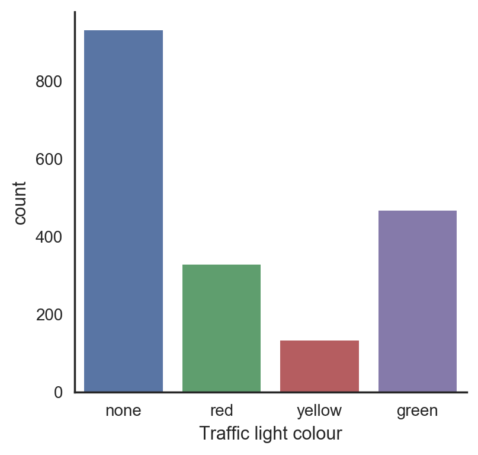

# Stanley2.0
Udacity Self Driving Car Final Project

## Real training data

The provided ROS bags contain two series of images taken from on-board camera:

- `loop_with_traffic_light.bag`: the car drives in circle. At the beginning of each loop there is a traffic light. The traffic light colour changes throughout the dataset. [VIDEO](https://youtu.be/lwdH3HAIAH0)
- `just_traffic_light.bag`: the car moves back and forth in front of the traffic light that changes colour. [VIDEO](https://youtu.be/nAYmVXXsOg8)

Images were extracted with scripts in `traffic_light_bag_files/`.

### Data exploration

The whole of the training images have been labeled by hand (see `labeler.py`). Two lists of image names and corresponding label are sorted in `just_labels.txt` and `loop_labels.txt` for the two set of images, respectively. The overall distribution of labels is reported below

The majority of the images does not have the traffic light in sight.

__TODO__: Augment training data to have a uniform distribution over the four classes.

Note, the _loop_ dataset does not contain any image with the yellow light.
